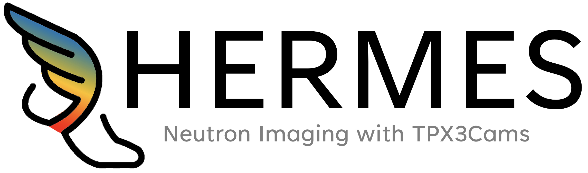

# HERMES: High-speed Event Retrieval and Management for Enhanced Spectral neutron imaging with TPX3Cams #

## What is HERMES? ##
HERMES comprises a set of Python and C/C++ libraries (not a standalone program) designed to support the development of custom code for acquiring, processing, and analyzing data from the TPX3Cam manufactured by [Amsterdam Scientific Instruments](https://www.amscins.com/buy-here/tpx3cam/ "ASI TPX3Cam"). HERMES' primary function is provide the foundational tools needed for users to create applications tailored to their specific requirements in energy-resolved neutron imaging with TPX3Cams, along with it's subsequent analysis. With HERMES users have access to a flexible framework that simplifies the integration of TPX3Cam's capabilities into their projects, while also providing the needed diagnostics for development and trouble shooting. 

## Getting Started ## 
Before using HERMES, ensure your system meets the necessary requirements and set up the environment variable for a seamless experience.


### Prerequisites ###
Below are instructions for installing prerequisites on Linux/macOS and Windows.  
**Note** HERMES has not been tested on any Windows systems directly, though it has been used successfully in WSL2 with ubuntu.  

#### PyHERMES Prerequisite Installation Options ####
pyHERMES requires Python 3.8 or later. Python can be obtained directly via download or by a third party platform like Anaconda3, apt-get, Homebrew. 
1. **Direct Installation:**
   - Visit [https://www.python.org/downloads/](https://www.python.org/downloads/) to download and install Python. Ensure to select the option to 'Add Python to PATH' during installation.

2. **Via Anaconda:**
   - Anaconda provides a convenient way to install Python and manage packages. Download and install Anaconda from [https://www.anaconda.com/products/individual](https://www.anaconda.com/products/individual). After installation, you can create a new environment for HERMES with Python 3.8:
     ```sh
     conda create --name hermes
     conda activate hermes
     ```
3. **Via apt or homebrew** 
    ```sh
     # Ubuntu/Debian
     sudo apt-get update
     sudo apt-get install python3.8
     ```
     ```sh
     # macOS
     brew install python@3.8
     ```
    
#### cHERMES Prerequisite Installation Options ###
cHERMES requires a C/C++ Compiler, along with CMake 3.15 or higher.
##### Linux/macOS #####

2. **GCC/G++ (Linux) or Xcode Command Line Tools (macOS):**
   - Linux:
     ```sh
     sudo apt-get install build-essential
     ```
   - macOS:
     - Install Xcode from the App Store, then open Terminal and run:
       ```sh
       xcode-select --install
       ```

3. **CMake:**
   - Install CMake using your package manager or from [https://cmake.org/download/](https://cmake.org/download/).
     ```sh
     # Ubuntu/Debian
     sudo apt-get install cmake
     ```
     ```sh
     # macOS
     brew install cmake
     ```
#### Windows ####
2. **Microsoft C++ Build Tools:**
   - Download and install the Build Tools for Visual Studio from [https://visualstudio.microsoft.com/visual-cpp-build-tools/](https://visualstudio.microsoft.com/visual-cpp-build-tools/). During installation, select the "C++ build tools" workload.

3. **CMake:**
   - Download and install CMake from [https://cmake.org/download/](https://cmake.org/download/). During installation, ensure you add CMake to the system PATH.


### Setting the Environment Variable ###
HERMES requires setting up the `HERMES_HOME` environment variable as well as additional variables for `cHERMES` and `pyHERMES`. These steps ensure that both the C/C++ libraries and Python modules are correctly recognized by your system.

**macOS/Linux Users:**
1. Open your shell profile file (`.bashrc`, `.zshrc`, etc.).
2. Add the following lines to set `HERMES_HOME` and the additional variables:
   ```sh
   export HERMES_HOME=/path/to/hermes
   export cHERMES_DIR=$HERMES_HOME/cHERMES
   export PYTHONPATH=$PYTHONPATH:$HERMES_HOME/pyHERMES
   ```
3. Replace /path/to/hermes with the actual installation path of HERMES on your machine.
4. Save the file.
5. Apply the changes by running 
```sh 
    source ~/.bashrc # or the equivalent command for your shell
```

**Windows Users:**

1. Search for "Edit the system environment variables" and open it.
2. Click "Environment Variables."
3. To set `HERMES_HOME`, under "User variables," click "New."
    - Set the Variable name to `HERMES_HOME`.
    - Set the Variable value to the path of your HERMES installation.
4. To set `cHERMES_DIR`, repeat the process to add a new User variable:
    - Set the Variable name to `cHERMES_DIR`.
    - Set the Variable value to `%HERMES_HOME%\cHERMES`.
5. To add `pyHERMES` to the Python path, find the Path variable under "User variables" (or "System variables" if you want it available system-wide) and edit it:
    - Click "New" and add `%HERMES_HOME%\pyHERMES`.
6. Click OK to save each variable.

These environment variable settings ensure that the system can properly locate and utilize the `cHERMES` and `pyHERMES` libraries. `HERMES_HOME` serves as the base directory for the entire HERMES suite, while `cHERMES_DIR` and the addition of `pyHERMES` to the `PYTHONPATH` enable specific functionality within the HERMES ecosystem

### Verifying Installation ###

To verify the environment variable:

**macOS/Linux Users:**
```sh
echo $HERMES_HOME
```

**Windows:**

```cmd
echo %HERMES_HOME%
```

### Starting with some Examples ###


## License ## 
HERMES is distributed as open-source software under an MIT License, with LANL open source approval (reference O4660). Please see LICENSE for more details. 